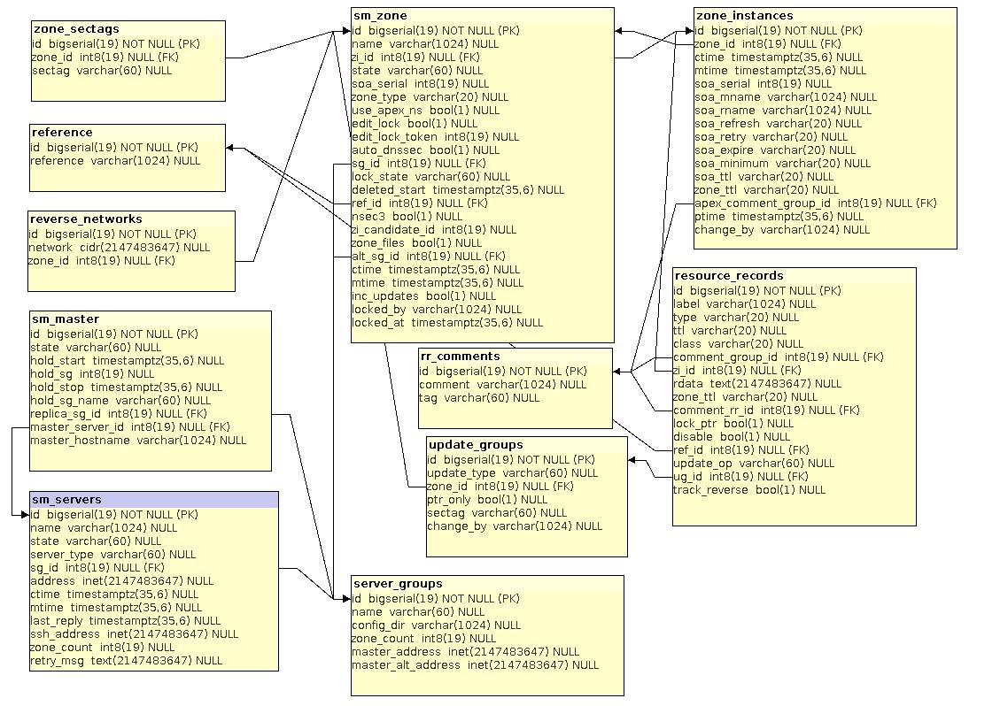
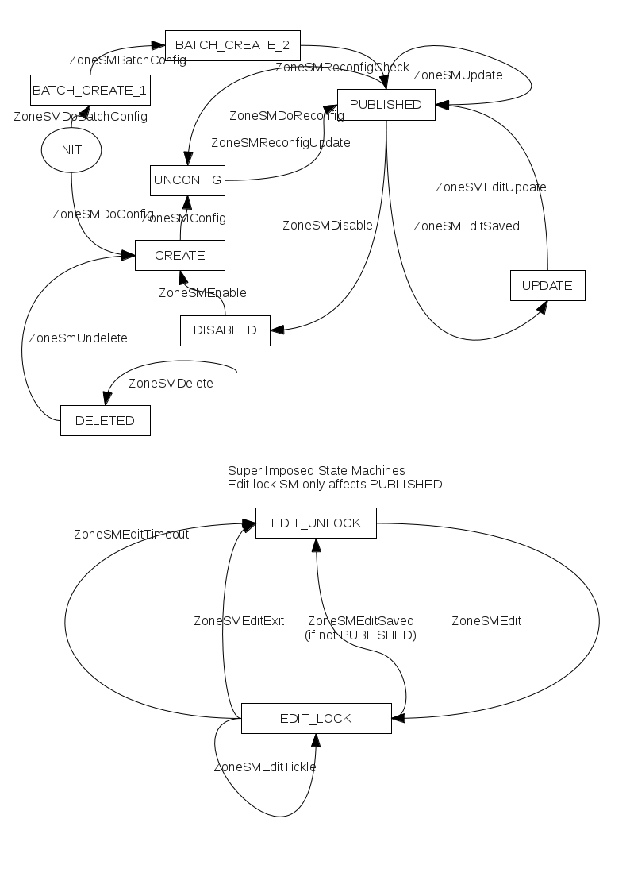
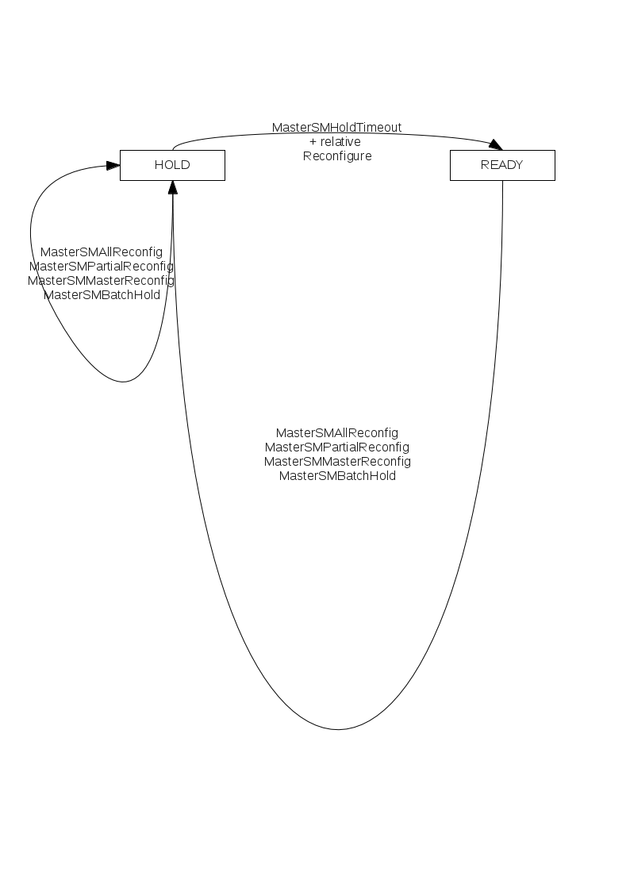
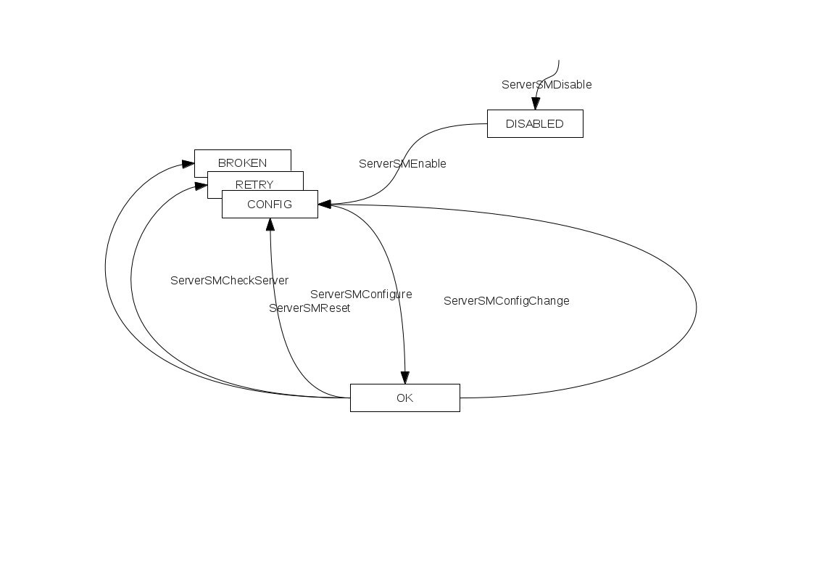

.. _System-Documentation:

********************
System Documentation
********************

.. _Auto Reverse PTRs:

Auto Reverse PTRs
=================

With the advent of IPv6, reverse zone management is recommended to only contain
real machine names, instead of macro generated addresses. The IPv6 reverse
format for ``ip6.arpa.`` is sub-domain per nibble, which is real squirrel brain
food, and will literally drive you dotty.

When provisioning a new network block, the first thing to do is to set up a
reverse zone, with ``inc_updates`` enabled.  The auto PTR update operations are
considered part of the incremental updates mechanism.

::

      zone_tool > create_zone 2001:db8:1:2:3::/52 inc_updates
      zone_tool . create_zone -r nuts@SQUIRREL-NZ my-new.zone.org
      zone_tool > edit_zone my-new.zone.org
      .
      .
      .
      @   IN    AAAA 2001:db8:1:2:3::1
      .
      .
      .
      zone_tool > show_zone 2001:db8:1:2:3::1
      .
      .
      .
      ;! REF:nuts@SQUIRREL-NZ
      0.0.0.0.0.0.0.0.0.0.0.1 IN PTR my-new.zone.org.
      .
      .
      .
      zone_tool >

All zones instances saved have the auto ``PTR`` data collected from ``AAAA``
records, and upon request from IPv4 ``A`` records . A privilege evaluation
based on the forward zones reference string, the reference string against any
existing reverse and reverse zone and sectag is then performed to determine if
the reverse zone is allowed to be updated.

Only the :abbr:`Admin (Administrative security tag)` sectag can give auto
reverse like that above automatically. Customer :abbr:`DMIs (DMS Management
Interfaces)` don't have that privilege . Customer DMIs can only update a PTR
record if the reference for the customer domain and the PTR record match, or if
the domain reference matches the reverse zone's reference.

The reverse zone tables are looked up in CIDR fashion when it comes to
auto-reverse PTR operations. Thus we can delegate a more specific reverse block
than an IPv6 /32 to a customers XDSL connection, and they can manage the
reverse space themselves from their forward domain. This CIDR functionality is
also used from :command:`zone_tool` to save on brain mashing. You can give an
IP address to show/edit a reverse zone, and an exact network block for zone
creation and zone config setting, and zone deletion.

If a reverse record does not exist yet, and the privilege checks pass, the PTR
record is created from the first AAAA record seen. The ``FORCEREV`` :abbr:`RR
(Resource Record)` flag can be used for create a PTR for an IPv4 A record.
Also, a ``FORCEREV`` RR flag may be used to force an update to a new value, and
a ``TRACKREV`` RR flag to make the PTR record to update on each forward zone
save.

The RR flags used on PTR records are ``REF:`` to delegate management operations,
and ``LOCKPTR`` to prevent a reverse record from ever being altered by the auto
reverse mechanism. This can be set on our main mail server and DNS server PTR
records.

.. _DB-Schema-Zone-Diagram:

DB Schema - Zone Diagram
========================

.. _Zone-DB-Schema-detail:

   Zone DB Schema detail.

.. _DMS-Central-config:

DMS Central config
==================

The DMS central configuration stored in the DMS database is displayed with the
:command:`show_config` command. It contains various ``default_`` settings used
during zone creation, DMS vacuuming, and apex record creation and refreshment.

::

        zone_tool > show_config
              auto_dnssec:              false
              default_ref:              anathoth
              default_ssg:              anathoth-external
              default_stype:            bind9
              edit_lock:                true
              event_max_age:            120.0
              inc_updates:              false
              nsec3:                    true
              soa_expire:               7d
              soa_minimum:              10m
              soa_mname:                ns1.anathoth.net. (anathoth-external)
              soa_mname:                ns1.internal.anathoth.net. (anathoth-internal)
              soa_refresh:              600
              soa_retry:                600
              soa_rname:                matthewgrant5.gmail.com.
              syslog_max_age:           120.0
              use_apex_ns:              true
              zi_max_age:               90.0
              zi_max_num:               25
              zone_del_age:             0.0
              zone_del_pare_age:        90.0
              zone_ttl:                 24h
      zone_tool >

The entries shown above can be set using the :command:`set_config` command::

      zone_tool > help set_config
              Set DB Configuration settings:

                set_config [-g sg_name] [sg_name] <key> <value>
                sg_name        sg_name for soa_mname
                Key can be one of:
                default_sg      Default Server Group
                default_ref     Default reference for created zones
                auto_dnssec     Boolean defaults used during initial zone creation
                edit_lock
                inc_updates
                nsec3
                use_apex_ns
                soa_mname       Used during initial zone creation
                soa_rname
                soa_refresh
                soa_retry
                soa_expire
                soa_minimum
                soa_ttl
                zone_ttl
                event_max_age   Defaults used when vacuuming deleted zones,
                syslog_max_age events, syslog messages and old zis.
                zi_max_num
                zi_max_age
                zone_del_age        0 turns off deleted zone aging via vacuum_*
                zone_del_pare_age   0 turns off zone zi paring to 1 via vacuum_*

      zone_tool > set_config auto_dnssec false
      zone_tool >

.. _DNSSEC-and-DMS:

DNSSEC and DMS
==============

The DMS backend supports DNSSEC operations. If the keys are created for a domain on the disk via the
:command:`dns-createzonekeys` script as root, then a DNSSEC enabled domain can either be created, or if the zone exists
it can be DNSSEC enabled. The keys created by the shell script are ``NSEC3`` and ``NSEC`` capable, of algorithm
``NSEC3RSASHA1``. The keys created have no expiration date. The DS material is in the :file:`/var/lib/bind/ds` directory,
with the keys in :file:`/var/lib/bind/keys` directory.

::

      shalom-ext: -root- [/var/lib/bind/keys]
      # dns-createzonekeys omg.blah.net
      + rm -f '/var/lib/bind/keys/Komg.blah.net.*'
      + rm -f /var/lib/bind/ds/omg.blah.net
      + dnssec-keygen -3 -r /dev/random -f KSK -K /var/lib/bind/keys omg.blah.net
      Generating key pair...................................+++
      ....................+++

      Komg.blah.net.+007+56550
      - dnssec-dsfromkey -2 /var/lib/bind/keys/Komg.blah.net.+007+56550.key
      - dnssec-keygen -3 -r /dev/random -K /var/lib/bind/keys omg.blah.net
      Generating key pair........................++++++
      .........................++++++
      Komg.blah.net.+007+30722
      - set +x

      shalom-ext: -root- [/var/lib/bind/keys]
      # zone_tool
      Welcome to the zone_tool program. Type help or ? to list commands.

      zone_tool > create_zone omg.blah.net auto_dnssec edit_lock
      .
      .
      .
      zone_tool > show_zonesm omg.blah.net
              name:            omg.blah.net.
              alt_ssg_name:    None
              auto_dnssec:     True
              ctime:           Fri Sep 7 15:32:18 2012
              deleted_start:   None
              edit_lock:       True
              edit_lock_token: None
              inc_updates:     False
              lock_state:      EDIT_UNLOCK
              locked_by:       None
              mtime:           Fri Sep 7 15:32:18 2012
              nsec3:           True
              reference:       anathoth
              soa_serial:      2012090705
              ssg_name:        anathoth-external
              state:           PUBLISHED
              use_apex_ns:     True
              zi_candidate_id: 102843
              zi_id:           102843
              zone_id:         101523
              zone_type:       DynDNSZoneSM

              zi_id:           102843
              change_by:       root@shalom-ext.internal.anathoth.net/Admin
              ctime:           Fri Sep 7 15:32:18 2012
              mtime:           Fri Sep 7 15:32:40 2012
              ptime:           Fri Sep 7 15:32:40 2012
              soa_expire:      7d
              soa_minimum:     10m
              soa_mname:       ns1.anathoth.net.
              soa_refresh:     600
              soa_retry:       600
              soa_rname:       matthewgrant5.gmail.com.
              soa_serial:      2012090705
              soa_ttl:         None
              zone_id:         101523

               zone_ttl:       24h
      zone_tool >
      zone_tool > show_zone omg.blah.net
      $TTL 24h
      $ORIGIN omg.blah.net.

      ;
      ;   Zone:        omg.blah.net.
      ;   Reference:   anathoth
      ;   change_by:   root@shalom-ext.internal.anathoth.net/Admin
      ;   zi_id:       102843
      ;   zi_ctime:    Fri Sep 7 15:32:18 2012
      ;   zi_mtime:    Fri Sep 7 15:32:40 2012
      ;   zi_ptime:    Fri Sep 7 15:32:40 2012
      ;

      ;| Apex resource records for omg.blah.net.
      ;!REF:anathoth
      @                       IN      SOA                ( ns1.anathoth.net. ;Master
      NS
                                                         matthewgrant5.gmail.com.
      ;RP email
                                                         2012090705   ;Serial
      yyyymmddnn
                                                         600          ;Refresh
                                                         600          ;Retry
                                                         604800       ;Expire
                                                         600
      ;Minimum/Ncache
                                                         )
                                 IN      NS              ns3.anathoth.net.
                                 IN      NS              ns2.anathoth.net.
                                 IN      NS              ns1.anathoth.net.

      zone_tool >

      shalom-ext: -root- [/var/lib/bind/ds]
      # cat omg.blah.net
      omg.blah.net. IN DS 56550 7 2
      2B2BFD4C06AF0B2CC3CFC6995555B05A1562A62D4A73C59148AFE582 CACEAE6F

``NSEC3`` non-walkable ``NX`` Domain processing can be selected for the zone by
using the :command:`zone_tool set_zone` command::

       zone_tool > set_zone omg.blah.net nsec3
       zone_tool >

Which takes the same flags as the :command:`create_zone` command.

.. note::
        
        For NSEC3, the secondary servers mast be capable of calculating NX responses to queries.
        Bind 9.6.3 ESRV and up are compatible with this requirement.

If the DS material for a domain needs to be recreated, use the :command:`dns-recreateds` command::

       shalom-ext: -root- [/var/lib/bind/keys]
       # dns-recreateds anathoth.net
       + dnssec-dsfromkey -2 /var/lib/bind/keys/Kanathoth.net.+007+57318.key
       + set +x

.. _etckeeper-and-/etc-on-Replica-and-Master-Servers:

``etckeeper`` and :file:`/etc` on Replica and Master Servers
============================================================

``etckeeper`` and ``ssh``
-------------------------

:command:`etckeeper` is a tool to keep the contents of :file:`/etc` in a git
VCS. When combined with :command:`ssh` and the appropriate :command:`git`
remote setup with ``cron``, it allows the :file:`/etc` of the other machine in
the master/replica DR pair to be kept on its alternate, and vice-versa. This
protects against the :file:`/etc` on the master being updated, the replica
being missed, and then finding that things aren't working on the replica when
the master dies, with no record of the updates needed for machine
configuration. For information on :command:`etckeeper` usage, see
:file:`/usr/share/doc/etckeeper/README.gz`. 

Example for diffing/checking out :file:`/etc/racoon/racoon-tool.conf` from
other machine::

       dms3-master:/etc# git diff dms4-dr/master racoon/racoon-tool.conf
       dms3-master:/etc# git checkout dms4-dr/master racoon/racoon-tool.conf
       dms3-master:/etc# git checkout HEAD racoon/racoon-tool.conf

.. warning::

            Be careful with the git checkout operation as missing the trailing
            path argument will cause :file:`/etc` to be changed to that of the other
            machine.

You can diff parts of etc against the other machine::

       dms-master-chc: -root- [/etc] # git diff dms-master-akl/master bind

       diff --git a/bind/rndc.conf b/bind/rndc.conf index 0b0d600..22f85c8
       100644 --- a/bind/rndc.conf +++ b/bind/rndc.conf @@ -8,20 +8,14 @@
       options { };

       -server    dms-master-chc {
       -          addresses { 2406:3e00:1001:1::2 port 953; };
       -          key "remote-key";
       -};
       -
       -
         server   dms-master-akl {
                  addresses { 2406:1e00:1001:1::2 port 953; };
                  key "remote-key";
        };

       -server    dms-ns2-chc {
       -          addresses { 2406:3e00:1001:2::2 port 953; };
       +server    dms-master-chc {
       +          addresses { 2406:3e00:1001:1::2 port 953; };
                  key "remote-key";
        };

       @@ -32,3 +26,9 @@ server dms-ns1-akl {
        };

       +server dms-ns2-chc {
       +       addresses { 2406:3e00:1001:2::2 port 953; };
       +       key "remote-key";
       +};
       +
       +

As well as checking out a directory/file so that it is same as on the other machine::

       dms-master-chc: -root- [/etc]
       # git checkout dms-master-akl/master bind/named.conf.options

Use :command:`etckeeper commit` to commit to the repository, and :command:`git fetch` on the other machine::

       dms-master-chc: -root- [/etc]
       # etckeeper commit
       .
       .
       .
       dms-master-akl: -root- [/etc]
       # git fetch dms-master-chc

.. note::
        
        Note that in the :file:`/etc` git repository, the revision trees for both of
        the machines are not connected together history wise, but they are very similar
        due to being installed from the same Linux distribution and package lists. So
        you have 2 completely separate trees in each git repository.

.. _Event-Queue-Inspection:

Event Queue Inspection
======================

The :command:`zone_tool` event queue inspection commands are:

+--------------------------------------+----------------------------------------------------------+
| :command:`show_event <event-id>`     | Given an event ID, show the contents of the event        |
+--------------------------------------+----------------------------------------------------------+
| :command:`ls_pending_events [-v]`    | List all pending events                                  |
+--------------------------------------+----------------------------------------------------------+
| :command:`ls_failed_events [-v] [n]` | List last *n* failed events, by default 25               |
+--------------------------------------+----------------------------------------------------------+
| :command:`ls_events [-v] [n]`        | List *n* events in queue in reverse order, by default 25 |
+--------------------------------------+----------------------------------------------------------+
| :command:`fail_event <event-id>`     | Manually fail an event                                   |
+--------------------------------------+----------------------------------------------------------+

The ``-v`` switch is for verbose output.

.. _Listing-Pending-Events:

Listing Pending Events
----------------------

This is probably the most used. By default it returns all the pending events. This is useful when you want to check
when the ``MasterSM`` is going to time out of ``HOLD``, a server is to be reconfigured or a Zone is to be reconfigured in
:file:`named.conf`. The example below displays the usual ``ServerSMCheckServer`` events, and then the result in the event
queue of :command:`zone_tool reconfig_all`.

::

       zone_tool > ls_pending_events
       ServerSMCheckServer       shalom-dr                             Tue   Nov   13   14:39:07   2012
       ServerSMCheckServer       dns-slave0                            Tue   Nov   13   14:44:15   2012
       ServerSMCheckServer       dns-slave1                            Tue   Nov   13   14:46:13   2012
       ServerSMCheckServer       en-gedi-auth                          Tue   Nov   13   14:43:04   2012
       ServerSMCheckServer       shalom-ext                            Tue   Nov   13   14:43:19   2012
       zone_tool > reconfig_all
       zone_tool > ls_pending_events -v
       ServerSMCheckServer 896877                              NEW
         dns-slave0
         Tue Nov 13 14:36:02 2012 Tue Nov 13        14:44:15 2012     --
       ServerSMCheckServer 896878                            NEW
         dns-slave1
         Tue Nov 13 14:36:20 2012 Tue Nov 13        14:46:13 2012     --
       ServerSMCheckServer 896879                            NEW
         en-gedi-auth
         Tue Nov 13 14:37:00 2012 Tue Nov 13        14:43:04 2012     --
       ServerSMCheckServer 896880                            NEW
         shalom-ext
         Tue Nov 13 14:37:49 2012 Tue Nov 13        14:43:19 2012     --
       ServerSMCheckServer 896881                            NEW
         shalom-dr
         Tue Nov 13 14:39:09 2012 Tue Nov 13        14:45:18 2012     --
       MasterSMAllReconfig 896882                            NEW

         Tue Nov 13 14:39:15 2012 Tue Nov 13 14:39:15 2012            --
       zone_tool > ls_pending_events
       ServerSMCheckServer       dns-slave0                            Tue   Nov   13   14:44:15   2012
       ServerSMCheckServer       dns-slave1                            Tue   Nov   13   14:46:13   2012
       ServerSMCheckServer       en-gedi-auth                          Tue   Nov   13   14:43:04   2012
       ServerSMCheckServer       shalom-ext                            Tue   Nov   13   14:43:19   2012
       ServerSMCheckServer       shalom-dr                             Tue   Nov   13   14:45:18   2012
       ServerSMConfigChange      shalom                                Tue   Nov   13   14:39:23   2012
       ServerSMConfigChange      en-gedi-auth                          Tue   Nov   13   14:39:23   2012
       ServerSMConfigChange      shalom-ext                            Tue   Nov   13   14:39:23   2012
       ServerSMConfigChange      shalom-dr                             Tue   Nov   13   14:39:23   2012
       ServerSMConfigChange      dns-slave0                            Tue   Nov   13   14:39:23   2012
       ServerSMConfigChange      dns-slave1                            Tue   Nov   13   14:39:23   2012
       MasterSMHoldTimeout                                             Tue   Nov   13   14:49:18   2012
       zone_tool >

.. _Listing-fialed-events:

Listing failed events
---------------------

Here is an example of how to list failed events::

        zone_tool > ls_failed_events
        ZoneSMEditTimeout    1142544                    FAILURE
          anathoth.net.               Fri Jun 27 09:40:04 2014  Fri Jun 27 09:41:25 2014
        ZoneSMEditTimeout    1142535                    FAILURE
          anathoth.net.               Fri Jun 27 09:39:00 2014  Fri Jun 27 09:39:29 2014
        ZoneSMEditTimeout    1140198                    FAILURE
          internal.anathoth.net.      Tue Jun 24 09:51:36 2014  Tue Jun 24 09:51:42 2014
        ZoneSMEditTimeout    1140190                    FAILURE
          anathoth.net.               Tue Jun 24 09:51:10 2014  Tue Jun 24 09:51:27 2014
        ZoneSMEditTimeout    1138791                    FAILURE
          internal.anathoth.net.      Sun Jun 22 23:04:04 2014  Sun Jun 22 23:05:51 2014
        ZoneSMEditTimeout    1138788                    FAILURE
          anathoth.net.               Sun Jun 22 23:03:15 2014  Sun Jun 22 23:03:35 2014
        ZoneSMEditTimeout    1138706                    FAILURE
          mattgrant.net.nz.           Sun Jun 22 21:09:40 2014  Sun Jun 22 21:10:26 2014
        ZoneSMEditTimeout    1138661                    FAILURE
          internal.anathoth.net.      Sun Jun 22 20:16:18 2014  Sun Jun 22 20:16:45 2014
        ZoneSMEditTimeout    1138634                    FAILURE
          anathoth.net.               Sun Jun 22 19:46:04 2014  Sun Jun 22 19:46:29 2014
        ZoneSMEditTimeout    1138622                    FAILURE
          internal.anathoth.net.      Sun Jun 22 19:45:40 2014  Sun Jun 22 19:45:59 2014
        ZoneSMEditTimeout    1138614                    FAILURE
          anathoth.net.               Sun Jun 22 19:45:18 2014  Sun Jun 22 19:45:31 2014
        ZoneSMEditTimeout    1138560                    FAILURE
          anathoth.net.               Sun Jun 22 18:30:14 2014  Sun Jun 22 18:31:37 2014
        ZoneSMEditTimeout    1137779                    FAILURE
          anathoth.net.               Sat Jun 21 22:26:02 2014  Sat Jun 21 22:27:18 2014
        ZoneSMEditTimeout    1137656                    FAILURE
          anathoth.net.               Sat Jun 21 19:15:26 2014  Sat Jun 21 19:18:09 2014
        ZoneSMEditTimeout    1124004                    FAILURE
          anathoth.net.               Mon May 12 21:44:03 2014  Mon May 12 21:44:05 2014
        ZoneSMEditTimeout    1124001                    FAILURE
          internal.anathoth.net.      Mon May 12 21:43:56 2014  Mon May 12 21:43:59 2014
        ZoneSMEditTimeout    1123312                    FAILURE
          internal.anathoth.net.      Sun May 11 21:12:04 2014  Sun May 11 21:12:08 2014
        ZoneSMEditTimeout    1123113                    FAILURE
          internal.anathoth.net.      Sun May 11 14:01:21 2014  Sun May 11 14:01:23 2014
        ZoneSMEditTimeout    1123093                    FAILURE
          internal.anathoth.net.      Sun May 11 13:24:12 2014  Sun May 11 13:24:22 2014
        ZoneSMEditTimeout    1112679                    FAILURE
          anathoth.net.               Sun Apr 27 18:27:11 2014  Sun Apr 27 18:27:38 2014
        ZoneSMEditTimeout    1112666                    FAILURE
          internal.anathoth.net.      Sun Apr 27 18:24:37 2014  Sun Apr 27 18:26:47 2014
        ZoneSMEditTimeout    1112036                    FAILURE
          anathoth.net.               Sat Apr 26 20:12:38 2014  Sat Apr 26 20:14:49 2014
        ZoneSMEditTimeout    1108303                    FAILURE
          internal.anathoth.net.      Mon Apr 21 18:27:37 2014  Mon Apr 21 18:28:00 2014
        ZoneSMEditTimeout    1108287                    FAILURE
          internal.anathoth.net.      Mon Apr 21 18:14:27 2014  Mon Apr 21 18:15:18 2014
        ZoneSMEditTimeout    1105472                    FAILURE
          anathoth.net.               Thu Apr 17 10:14:30 2014  Thu Apr 17 10:15:12 2014
        zone_tool > 

.. _Importing-Nuking-and-Destroying-Zones:

Importing, Nuking, and Destroying Zones
=======================================

:command:`Zone_tool` has a number of commands to enable the import of single
zones, single ZIs and multiple zones from a single
directory(:command:`load_zone`, :command:`load_zone_zi`,
:command:`load_zones`), as well as the :command:`nuke_zones` command to remove
incorrect imports from the DMS DB.

The :command:`zone_tool destroy_zone` command can also be used to erase a
single zone by its ``zone_id`` once it is deleted, and its named zone files
flushed by the :command:`dmsdmd` daemon. The
:command:`vacuum_zone`/:command:`vacuum_all` commands will immediately DELETE
the zones from the DB once the named zone files and configuration are cleaned
up on the DMS master server.

.. note::
            
        When importing zones, take care to specify the correct SECTAG,
        ``inc_updates`` flag, and SG group for the zones.

The ``-f`` flag can be given for use from scripts with these
:command:`zone_tool` commands. The :command:`load_zones` command will continue
to import other zones if a parse error occurs for some of the zones. Error
messages for each incorrect zone file will be printed to stdout, including line
number, for correction and subsequent import. :command:`Zone_tool load_zones`
expects that the file name for the zone is the actual exact domain name. Thus::

       grantma@dms3-master:~/test-zones/domain-reseller$ zone_tool load_zones -f *
       ***   Zone file '30somethings.co.aq': zone '30somethings.co.aq.' already
             exists.
       ***   Zone file 'foo-software.com': zone 'foo-software.com.' already
             exists.
       ***   Zone file 'fredmeansbusiness.co.aq': zone
             'fredmeansbusiness.co.aq.' already exists.
       ***   Zone file 'wallshop.co.aq': zone 'wallshop.co.aq.' already exists.
       ***   Zone file 'altair.co.aq': zone 'altair.co.aq.' already exists.
       ***   Zone file 'alternative-coats.co.aq': zone 'alternative-coats.co.aq.' 
             already exists.
       ***   Zone file 'roaring-meg.co.aq': zone 'roaring-meg.co.aq.' already exists.
       ^Cgrantma@dms3-master:~/test-zones/domain-reseller$
       grantma@dms3-master:~/test-zones/domain-reseller$ ^C
       grantma@dms3-master:~/test-zones/domain-reseller$ zone_tool nuke_zones -f *

The zone import code uses the same file parsing code that is used from the
:command:`zone_tool edit_zone` command. The ``dms.dms.zone_parser`` module is a
complete enough implementation of the :rfc:`1035` and :rfc:`1034` zone file
formats. All the RFC ``$`` directives are parsed, and unsupported directives
rejected with clear error messages.

The JSON RPC mechanism also supports zone file format import operations, along
with zone file based editing operations. This is so that Web control panel zone
file editors can be easily integrated with the system.

.. _Master and DR Replica Setup:
       
Master and DR Replica Setup
===========================

The master servers for the DMS are primarily a pair of servers, with the master
of the pair operating named as the DNS master server for all zones, running
:program:`dmsdmd`, and running the master PostgresQL DMS database. The replica
of the pair operates a BIND DNS slave server of all the zones, and PostgresQL
in hot standby mode.

Upon failure of the DMS master, the replica's :program:`named` can be restarted
as the master DNS server, PostgresQL promoted to full master, and
:program:`dmsdmd` started.

The above fail-over is achieved by manually running the
:command:`dms_promote_replica` script on the replica server. The master server
can be taken off line using the :command:`dms_master_down` script (the
:command:`dms_master_up` script reverses this operation).  After the master has
been taken down, it can be restarted as the master replica by using the
:command:`dms_start_as_replica` script.

The settings for the :command:`dms_` scripts are in the
:file:/etc/dms/dr-settings.sh file. The full list of the DMS fail over scripts
is:

+------------------------------------+------------------------------------------------------+
|  DMS DR script                     |     Function                                         |
+====================================+======================================================+
| :command:`dms_master_down`         | Manually take master down                            |
+------------------------------------+------------------------------------------------------+
| :command:`dms_master_up`           | Manually bring master up from above operation        |
+------------------------------------+------------------------------------------------------+
| :command:`dms_promote_replica`     | Promote replica server to master                     |
+------------------------------------+------------------------------------------------------+
| :command:`dms_start_as_replica`    | Restart/start a machine as a replica                 |
+------------------------------------+------------------------------------------------------+
| :command:`dms_pg_basebackup`       | Component operation - create PG host standby replica |
|                                    | data base                                            |
+------------------------------------+------------------------------------------------------+
| :command:`dms_write_recovery_conf` | Component operation - create PG recovery.conf file   |
+------------------------------------+------------------------------------------------------+
| :command:`dms_update_wsgi_dns`     | Component operation - update DMS failover CNAME      |
|                                    | record                                               |
+------------------------------------+------------------------------------------------------+

::

     shalom-ext: -root- [/home/grantma]
     # dms_master_down
     Stopping interface: dummy0.
     + do_dms_drif
     + [ -n dummy0 ]
     + return 0
     + perl -pe s/^(IF_AUTO.*)\s+dummy0(.*$)/\1\2/g -i
     /etc/netscript/network.conf
     + perl -pe s/^(IF_AUTO=")dummy0\s+(.*$)/\1\2/g -i
     /etc/netscript/network.conf
     + do_dms_wsgi
     + return 1
     + perl -pe s/^([^#].*zone_tool vacuum_all)$/#\1/ -i /etc/cron.d/dms-core
     + set +x
     [ ok ] Stopping net24dmd: net24dmd.
     [ ok ] Stopping domain name service...: bind9.
     + perl -pe s/^(local7.* :ompgsql:\S+,dms,rsyslog,.*$)/#\1/ -i
     /etc/rsyslog.d/pgsql.conf
     + set +x
     [ ok ] Stopping enhanced syslogd: rsyslogd.
     [ ok ] Starting enhanced syslogd: rsyslogd.
     [ ok ] Stopping PostgreSQL 9.1 database server: dms.
     + perl -pe s/^NET24DMD_ENABLE=.*$/NET24DMD_ENABLE=false/ -i
     /etc/default/net24dmd
     + perl -pe s/^OPTIONS=.*$/OPTIONS="-u bind -c
     \/etc\/bind\/named-dr-slave.conf"/ -i /etc/default/bind9

     shalom-ext: -root- [/home/grantma]
     .
     .
     .
     root@shalom-dr:/home/grantma# dms_promote_replica
     + perl -pe s/^#(\s*local7.* :ompgsql:\S+,dms,rsyslog,.*$)/\1/ -i
     /etc/rsyslog.d/pgsql.conf
     + set +x
     [ ok ] Stopping enhanced syslogd: rsyslogd.
     [ ok ] Starting enhanced syslogd: rsyslogd.
     - perl -pe s/^NET24DMD_ENABLE=.*$/NET24DMD_ENABLE=true/ -i
     /etc/default/net24dmd
     - perl -pe s/^OPTIONS=.*$/OPTIONS="-u bind"/ -i /etc/default/bind9
     - set +x
     [....] Stopping domain name service...: bind9waiting for pid 27511 to die
     . ok
     [ ok ] Starting domain name service...: bind9.
     [....] Starting net24dmd: net24dmd***    DB in Read Only mode -
     (InternalError) cannot execute INSERT in
            a read-only transaction 'INSERT INTO update_groups (update
       failed!
     - zone_tool write_rndc_conf
     - zone_tool reconfig_all
     - perl -pe s/^#+(.*zone_tool vacuum_all)$/\1/ -i /etc/cron.d/dms-core
     - do_dms_wsgi
     - return 1
     - set +x
     - perl -pe s/^(IF_AUTO=.*)"$/\1 dummy0"/g -i /etc/netscript/network.conf
     - set +x
     Configuring interface: dummy0.
     root@shalom-dr:/home/grantma#
     .
     .
     .
     shalom-ext: -root- [/home/grantma]
     # dms_start_as_replica
     dms_start_as_replica: Will replicate from 'shalom-dr.anathoth.net'
     Operation will destroy all data Proceed? (y/N)y
     dms_start_as_replica: replicating from 'shalom-dr.anathoth.net'
     341707/341707 kB (100%), 1/1 tablespace
     [ ok ] Stopping net24dmd: net24dmd.
     - do_dms_drif
     - [ -n dummy0 ]
     - return 0
     - perl -pe s/^(IF_AUTO.*)\s+dummy0(.*$)/\1\2/g -i
     /etc/netscript/network.conf
     - perl -pe s/^(IF_AUTO=")dummy0\s+(.*$)/\1\2/g -i
     /etc/netscript/network.conf
     - do_dms_wsgi
     - return 1
     - perl -pe s/^(local7.* :ompgsql:\S+,dms,rsyslog,.*$)/#\1/ -i
     /etc/rsyslog.d/pgsql.conf
     - perl -pe s/^([^#].*zone_tool vacuum_all)$/#\1/ -i /etc/cron.d/dms-core
     - perl -pe s/^NET24DMD_ENABLE=.*$/NET24DMD_ENABLE=false/ -i
     /etc/default/net24dmd
     - perl -pe s/^OPTIONS=.*$/OPTIONS="-u bind -c
     \/etc\/bind\/named-dr-slave.conf"/ -i /etc/default/bind9
     - set +x
     [ ok ] Starting PostgreSQL 9.1 database server: dms.
     [ ok ] Starting domain name service...: bind9.

     shalom-ext: -root- [/home/grantma]
     #

At any time, the status of the cluster can be displayed on any of the Master
servers (running and replicas) using the :command:`zone_tool show_dms_status`
command::

       zone_tool > show_dms_status

       show_master_status:

                  MASTER_SERVER:            shalom-ext

                  NAMED master configuration state:

                  hold_sg:                  HOLD_SG_NONE
                  hold_sg_name:             None
                  hold_start:               None
                  hold_stop:                None
                  replica_sg_name:          anathoth-replica
                  state:                    READY

       show_replica_sg:
               sg_name:                        anathoth-replica
               config_dir:                     /etc/bind/anathoth-master
               master_address:                 2001:470:f012:2::2
               master_alt_address:             2001:470:f012:2::3
               replica_sg:                     True
               zone_count:                     14

                  Replica SG named status:
                  shalom-dr                               2001:470:f012:2::3

                             OK

       ls_server:
       dns-slave0                   Thu Nov 8 12:04:25 2012                                           OK
               2001:470:c:110e::2                      111.65.238.10
               ping: 5 packets transmitted, 5 received, 0.00% packet                        loss
       dns-slave1                   Thu Nov 8 12:01:58 2012                                           OK
               2001:470:66:23::2                       111.65.238.11
               ping: 5 packets transmitted, 5 received, 0.00% packet                        loss
       en-gedi-auth                 Thu Nov 8 12:08:05 2012                                           OK
               fd14:828:ba69:6:5054:ff:fe39:54f9       172.31.12.2
               ping: 5 packets transmitted, 5 received, 0.00% packet                        loss
       shalom                       Thu Nov 8 12:04:12 2012                                           OK
               fd14:828:ba69:1:21c:f0ff:fefa:f3c0      192.168.110.1
               ping: 5 packets transmitted, 5 received, 0.00% packet                        loss
       shalom-dr                    Thu Nov 8 12:04:46 2012                                           OK
               2001:470:f012:2::3                      172.31.10.4
               ping: 5 packets transmitted, 5 received, 0.00% packet                        loss
       shalom-ext                   Thu Nov 8 12:04:12 2012                                           OK
               2001:470:f012:2::2                      172.31.10.2
               ping: 5 packets transmitted, 5 received, 0.00% packet loss

       list_pending_events:
       ServerSMCheckServer       dns-slave1                   Thu Nov   8 12:11:25
       2012
       ServerSMCheckServer       shalom-ext                   Thu Nov   8 12:12:15
       2012
       ServerSMCheckServer       shalom                       Thu Nov   8 12:13:47
       2012
       ServerSMCheckServer       dns-slave0                   Thu Nov   8 12:14:23
       2012
       ServerSMCheckServer       shalom-dr                    Thu Nov   8 12:14:19
       2012
       ServerSMCheckServer       en-gedi-auth                 Thu Nov   8 12:15:58
       2012

       zone_tool >

.. _Master-server-SM-and-Reconfiguration:

Master server SM, and Reconfiguration
=====================================

At its core, DMS has a master server state machine (``MasterSM``) which is used to
drive the ``ServerSM`` state machines via each SG. The master status can be shown
via :command:`show_master_status`::

      zone_tool > show_master_status

                 MASTER_SERVER:           shalom-ext

                 NAMED master configuration state:

              hold_sg:                    HOLD_SG_NONE
              hold_sg_name:               None
              hold_start:                 None
              hold_stop:                  None
              replica_sg_name:            anathoth-replica
              state:                      READY
      zone_tool >

It drives the 10 minute :command:`rndc` cycle for the DMS master DNS server and
all slaves. It has 2 states, ``HOLD`` and ``READY``.

::

       zone_tool > show_master_status

                  MASTER_SERVER:            shalom-ext

                  NAMED master configuration state:

               hold_sg:           HOLD_SG_NONE
               hold_sg_name:      None
               hold_start:        Thu Nov 8 12:58:37 2012
               hold_stop:         Thu Nov 8 13:08:37 2012
               replica_sg_name:   anathoth-replica
               state:             HOLD
       zone_tool > ls_pending_events
       ServerSMCheckServer       dns-slave0                                       Thu Nov      8 12:59:17
       2012
       ServerSMCheckServer       shalom                                           Thu Nov      8 13:00:57
       2012
       ServerSMCheckServer       en-gedi-auth                                     Thu Nov      8 13:01:26
       2012
       ServerSMCheckServer       shalom-dr                                        Thu Nov      8 13:02:29
       2012
       ServerSMCheckServer       dns-slave1                                       Thu Nov      8 13:02:06
       2012
       ServerSMCheckServer       shalom-ext                                       Thu Nov      8 13:04:29
       2012
       ServerSMConfigChange      shalom                                           Thu Nov      8 12:58:42
       2012
       ServerSMConfigChange      en-gedi-auth                                     Thu Nov      8 12:58:42
       2012
       ServerSMConfigChange      shalom-ext                                       Thu Nov      8 12:58:42
       2012
       ServerSMConfigChange      shalom-dr                                        Thu Nov      8 12:58:42
       2012
       ServerSMConfigChange      dns-slave1                                       Thu Nov      8 12:58:42
       2012
       ServerSMConfigChange      dns-slave0                                       Thu Nov      8 12:58:42
       2012
       MasterSMHoldTimeout                                                        Thu Nov      8 13:08:37
       2012
       zone_tool >

During the hold state, any reconfiguration requests will be honored for either
all SGs, or partially for one SG. That is what is tracked via the ``hold_sg``
and ``hold_sg_name`` fields displayed above. The ``hold_start`` and
``hold_stop`` fields are time stamps for start and end of a HOLD period.
After a HOLD, and during READY any configuration change for :program:`named` will
immediately happen, followed by the HOLD :command:`rndc` wait period.

The :command:`reconfig_all` command reconfigures ALL SGs, replicas and slaves.
:command:`reconfig_master`, only the master DNS server,
:command:`reconfig_replica_sg`, the replica SG group consisting of the DMS
master server and all replicas. And last but not least :command:`reconfig_sg
<sg-name>` reconfigures one SG. These commands configure all the name server
configuration for the DNS servers involved in the DNS server network. For
example for ISC BIND named, this is the :file:`named.conf` contents.

The following is log of a :program:`zone_tool` terminal session demonstrating the ``reconfig`` commands. Note how the ``hold_sg``
changes as one SG, replica SG, being individually reconfigured, and full reconfiguration. The scope of the
reconfigure is stored if the Master SM is in HOLD, escalated if needed, and then performed after the
``MasterSMHoldTimeout`` event exits the HOLD state.

.. note::

            If the ``MasterSMHoldTimeOut`` event goes missing, the HOLD state will not be exited. This
            evidence of this is that hold_start and hold_stop are both in the past. A zone_tool reset_master
            command will be needed to restart the Master State Machine (MasterSM)

::

      zone_tool > help reconfig_master

                  Reconfigure master DNS server: reconfig_master

                  Reconfigures the master DNS server via 'rndc reconfig'

      zone_tool > help reconfig_replica_sg

                  Reconfigure the Replica SG's DNS servers:

                  reconfig_replica_sg

                  Rsyncs DNSSEC key material to all DR replicas, and reconfigure all
      the
                  DR replica named processes.

      zone_tool > reconfig_master
      zone_tool > show_master_status

                  MASTER_SERVER:            shalom-ext

                  NAMED master configuration state:

              hold_sg:           HOLD_SG_NONE
              hold_sg_name:      None
              hold_start:        Thu Nov 8 12:11:22 2012
              hold_stop:         Thu Nov 8 12:21:22 2012
              replica_sg_name:   anathoth-replica
              state:             HOLD
      zone_tool > reconfig_replica_sg
      zone_tool > show_master_status

                  MASTER_SERVER:            shalom-ext

                  NAMED master configuration state:

                  hold_sg:                  14
                  hold_sg_name:             anathoth-replica

        hold_start:        Thu Nov 8 12:11:22 2012
        hold_stop:         Thu Nov 8 12:21:22 2012
        replica_sg_name:   anathoth-replica
        state:             HOLD
        zone_tool > ls_pending_events
        ServerSMCheckServer       shalom-ext                 Thu Nov   8 12:12:15
        2012
        ServerSMCheckServer       shalom                     Thu Nov   8 12:13:47
        2012
        ServerSMCheckServer       dns-slave0                 Thu Nov   8 12:14:23
        2012
        ServerSMCheckServer       shalom-dr                  Thu Nov   8 12:14:19
        2012
        ServerSMCheckServer       en-gedi-auth               Thu Nov   8 12:15:58
        2012
        MasterSMHoldTimeout                                  Thu Nov   8 12:21:22
        2012
        ServerSMCheckServer       dns-slave1                 Thu Nov   8 12:18:38
        2012
        zone_tool >
        .
        .
        .
        zone_tool > reconfig_sg anathoth-internal
        zone_tool > ls_pending_events
        ServerSMCheckServer       dns-slave1                 Thu Nov   8 12:28:33
        2012
        ServerSMCheckServer       shalom-ext                 Thu Nov   8 12:26:07
        2012
        ServerSMCheckServer       dns-slave0                 Thu Nov   8 12:26:11
        2012
        MasterSMHoldTimeout                                  Thu Nov   8 12:31:26
        2012
        ServerSMCheckServer       shalom                     Thu Nov   8 12:29:35
        2012
        ServerSMCheckServer       shalom-dr                  Thu Nov   8 12:31:43
        2012
        ServerSMCheckServer       en-gedi-auth               Thu Nov   8 12:33:26
        2012
        zone_tool > show_master_status

                MASTER_SERVER:     shalom-ext

                NAMED master configuration state:

                hold_sg:           8
                hold_sg_name:      anathoth-internal
                hold_start:        Thu Nov 8 12:21:26 2012
                hold_stop:         Thu Nov 8 12:31:26 2012
                replica_sg_name:   anathoth-replica
                state:             HOLD
        zone_tool >

        .
        .
        .
        zone_tool > show_master_status

                MASTER_SERVER:     shalom-ext

                NAMED master configuration state:

                hold_sg:           HOLD_SG_NONE
                hold_sg_name:      anathoth-internal
                hold_start:        Thu Nov 8 12:31:32 2012
                hold_stop:         Thu Nov 8 12:41:32 2012
                replica_sg_name:   anathoth-replica
                state:             HOLD
        zone_tool > reconfig_all
        zone_tool > show_master_status

                MASTER_SERVER:     shalom-ext

                NAMED master configuration state:

                hold_sg:           HOLD_SG_ALL
                hold_sg_name:      None
                hold_start:        Thu Nov 8 12:31:32 2012
                hold_stop:         Thu Nov 8 12:41:32 2012
                replica_sg_name:   anathoth-replica

                       state:                       HOLD
               zone_tool >

.. _Named.conf-and-Zone-Templating:
     
Named.conf and Zone Templating
======================================

On all the servers in the DMS system, the DNS server configuration is designed
to use include files and per zone templates. The master and replica servers are
currently BIND v9 only, but the DMS is designed to support different types of DNS servers
(configured as slave servers) such as `NSD v3
<http://www.nlnetlabs.nl/projects/nsd/>`, `Knot <http://www.knot-dns.cz>`, as
well as `BIND 9 <http://www.isc.org>`.

To simplify the authentication for the DNS servers, the network connection
between the master and replica/slave servers is encrypted and integrity
protected by using IPSEC. This enables the BIND 9 ACLs to specified by IP
address only, simplifying the configuration segments that need to be generated
for the DNS replica/slave servers.

The include files are generated on the master, rsynced to all the servers, and
then the servers are reconfigured via the rndc protocol or by a local daemon on
the server stating the rsynced include file. If one of the servers gets
compromised, it can be cut off by disabling its IPSEC connection or halting it.

+---------------------------------------------+------------------------+--------------------------------------------------------------------+
| File/Directory                              |  Server                | Description                                                        |
+=============================================+========================+====================================================================+
| :file:`/var/lib/dms/rsync-config`           | slaves and replicas    | :file:`named.conf` include segments                                |
|                                             | (master as replica     |                                                                    |
|                                             | for DR)                |                                                                    |
+---------------------------------------------+------------------------+--------------------------------------------------------------------+
| :file:`/var/lib/dms/master-config`          | master (replica - DR)  | Master :file:`named.conf` include                                  |
|                                             |                        | segment                                                            |
+---------------------------------------------+------------------------+--------------------------------------------------------------------+
| :file:`/etc/dms/server-admin-config/bind9`  | master (replica - DR)  | :file:`named.conf` segments for ``bind9``                          |
|                                             |                        | slaves. Seperate segments for                                      |
|                                             |                        | controls, logging, options and local.                              |
|                                             |                        | :command:`zone_tool rsync_server_admin_config`                     |
|                                             |                        | distributes these portions out.                                    |
+---------------------------------------------+------------------------+--------------------------------------------------------------------+
| :file:`/etc/dms/server-config-templates`    | master (replica - DR)  | Zone templates for replicas and slaves. See below.                 |
+---------------------------------------------+------------------------+--------------------------------------------------------------------+
| :file:`/etc/dms/master-config-templates`    | master (replica - DR)  | zone templates for running master :file:`named.conf`               |
+---------------------------------------------+------------------------+--------------------------------------------------------------------+
| :file:`/etc/dms/config-templates`           | master (replica - DR)  | :file:`rndc.conf` templates for creating                           |
|                                             |                        | :file:`/etc/bind/rndc.conf`, and TSIG key                          |
|                                             |                        | template for :command:`zone_tool tsig_key_generate`                |
+---------------------------------------------+------------------------+--------------------------------------------------------------------+
| :file:`/var/lib/dms/dms-sg`                 | master (replica - DR)  | Per SG include dirs for configuration segments to be rsynced.      |
+---------------------------------------------+------------------------+--------------------------------------------------------------------+
| :file:`/etc/dms/bind`                       | master (replicas - DR) | Configuration generated by :program:`dmsdmd` for :program:`named`. |
+---------------------------------------------+------------------------+--------------------------------------------------------------------+
| :file:`/etc/dms/bind/named-dr-replica.conf` | master (replica - DR)  | Slave :program:`named` configuration for                           |
|                                             |                        | replicating running master                                         |
|                                             |                        | :file:`/var/lib/bind/dynamic` zone                                 |
|                                             |                        | database. Contains DNSSEC                                          |
|                                             |                        | RRSIG and other non-database                                       |
|                                             |                        | :program:`bind9` master data that should be                        |
|                                             |                        | replicated.                                                        |
+---------------------------------------------+------------------------+--------------------------------------------------------------------+
| :file:`/var/lib/dms/dms-sg`                 | master (replica - DR)  | Per SG include dirs for configuration segments to be rsynced.      |
+---------------------------------------------+------------------------+--------------------------------------------------------------------+
| :file:`/var/lib/bind/dynamic`               | master and replicas    | Named DNS dynamic database. Contains DNS cryptographic data that   |
|                                             |                        | should be replicated between master servers. Replicated via        |
|                                             |                        | Replica slave named process.                                       |
+---------------------------------------------+------------------------+--------------------------------------------------------------------+
| :file:`/var/cache/bind/slave`               | All slaves             | Slave zone cache database.                                         |
+---------------------------------------------+------------------------+--------------------------------------------------------------------+

.. note::
         
        All the directories listed above for the master should be manually synchronised with the all
        replicas for reliable fail over.

In all the following templates, the keys used are the ones given in the files. They are of the Python string ``%/sprintf``
form ``%(key_name)s``

Master :file:`named.conf` include templates in /etc/dms/master-config-templates are:

+---------------------------------+------------------------------------+
| File                            | Description                        |
+=================================+====================================+
| :file:`auto-dnssec-config.conf` | DNSSEC dynamic DNS zone template   |
+---------------------------------+------------------------------------+
| :file:`dynamic-config.conf`     | dynamic DNS zone template          |
+---------------------------------+------------------------------------+
| :file:`server-acl.conf`         | template for server ACLs           |
+---------------------------------+------------------------------------+
| :file:`slave-config.conf`       | Slave DNS zone template - not used |
+---------------------------------+------------------------------------+
| :file:`static-config.conf`      | Static zone template - not used    |
+---------------------------------+------------------------------------+

Server :file:`named.conf` include templates in :file:`/etc/dms/server-config-templates` and segments are:

+----------------------------+----------------------------------------+
| File                       | Description                            |
+============================+========================================+
| :file:`bind9.conf`         | :program:`Bind9` slave zone template   |
+----------------------------+----------------------------------------+
| :file:`bind9-replica.conf` | :program:`Bind9` replica zone template |
+----------------------------+----------------------------------------+

:program:`Nsd3` server zone config templates would have ``nsd3`` in their name.

Administration server :file:`named.conf` segments in :file:`/etc/net24/server-admin-config/bind9` are:

+-------------------------+-------------------------------------------------------------------+
| File                    | Description                                                       |
+=========================+===================================================================+
| :file:`controls.conf`   | Controls segment of named.conf. Used to control :command:`rndc`   |
|                         | access                                                            |
+-------------------------+-------------------------------------------------------------------+
| :file:`logging.conf`    | Logging :file:`named.conf` segment. Configures named to log       |
|                         | to ``local7`` facility.                                           |
+-------------------------+-------------------------------------------------------------------+
| :file:`options.conf`    | Options include segment. Needs to be included as it is            |
|                         | better to manually specify ``listen-on`` directives on each       |
|                         | individual server                                                 |
+-------------------------+-------------------------------------------------------------------+
| :file:`rndc-remote.key` | :command:`Rndc` remote key used in :file:`/etc/bind/rndc.conf` on |
|                         | masters, and in :file:`controls.conf` above.                      |
+-------------------------+-------------------------------------------------------------------+

The above segments are free form, and can be rearranged. No fields are filled in from :program:`dmsdmd`.

Miscellaneous templates in :file:`/etc/net24/config-templates` are:

+--------------------------+-------------------------------------------------------------+
| File                     | Description                                                 |
+==========================+=============================================================+
| :file:`rndc.conf-header` | Top of :file:`rndc.conf`. Contains default settings and key |
|                          | includes                                                    |
+--------------------------+-------------------------------------------------------------+
| :file:`rndc.conf-server` | Per server :file:`rndc.conf` template                       |
+--------------------------+-------------------------------------------------------------+
| :file:`tsig.key`         | :command:`zone_tool tsig_key_generate` TSIG key template    |
+--------------------------+-------------------------------------------------------------+

.. _Netscript-Iptables-and-Filtering-Incoming-IPSEC:

Netscript, Iptables and Filtering Incoming IPSEC
================================================

As the servers over seas and across other networks are connected to using IPSEC
transport mode to secure the zone traffic for business confidentiality and
competition reasons, and for ease of :file:`named.conf` configuration, the
incoming traffic has to be filtered on the DMS master server. The IPSEC
Security Policy Database is not stateful, and is just IP address based when in
comes to multiple ports being opened, especially many to one in both
directions. If one of the slaves is compromised the SPD cannot prevent any one
on that host from connecting back to any port on the Master DMS servers. The
SPD can only really deal with many to one port type IPSEC relationships.

.. note::

   :program:`Netscript-ipfilter` is the package that most of you will want to use.
   The filtering below functionality been made available in it.  As part of the move
   to systemd, DMS will be made to work with :program:`ifupdown` when it comes to DR.

:program:`Netscript-2.4` is one of my tools for managing network configuration
and :program:`iptables` under Debian. It uses
:command:`iptables-save`/:command:`iptables-restore` with roll back. It is
inspired by my experience with programming routers, in terms of interface
manipulation and IP filtering. It replaces :program:`ifupdown`, which is
probably fundamentally broken according to the router RFC1812 in terms of
interface manipulation and addressing (pseudo-device concept for each address,
whereas kernel complies with this.)

The network configuration is in :file:`/etc/netscript/network.conf`. This file
is a actually sourced as a shell script by :file:`/sbin/netscript`. IP
addresses are set in the ``eth0_IPADDR`` variable, with ``IF_AUTO`` specifying
the interfaces brought up on boot.

The :command:`netscript` command has the following help::

       dms-chc: -root- [/etc/net24/conf-templates]
       # netscript
       Usage: netscript start|stop|reload|restart
              netscript ifup|ifdown|ifqos|ifreload
                   {eth0|dms0|dms1|gre0|sit0|all}
              netscript compile [-fqh] [-b max-backup-level]
       Usage: netscript ipfilter load|clear|fairq|flush|fwd|nofwd|reload|save
                                      usebackup [backup-number]
              netscript ipfilter exec
       Configure|FORWARD|INPUT|icmpfwd|icmphost|inbrdr|ingress|ingrssfwd|ipfwd|ipl
       cl|laptopfw|log|martians|outbrdr|portscan|smb|snmp
                                      [chain p1 p2 ...]
       Usage: netscript ip6filter load|clear|fairq|flush|fwd|nofwd|reload|save
                                      usebackup [backup-number]
              netscript ip6filter exec icmphost|laptopfw|log
                                      [chain p1 p2 ...]

as well as man pages. The :command:`netscript ipfilter`/:command:`ip6filter`
verbs are the ones used to save and load/reload the firewall configuration. The
:program:`iptables` files are saved as
:file:`/etc/netscript/iptables{,.1,.2,.3}` and
:file:`/etc/netscript/ip6tables{,.1,.2,.3}`.

The number of roll back files can be altered in the :file:`network.conf` file.
The :command:`netscript ipfilter exec` shell functions create a chain of the
given name, with addresses and networks possibly given as variables in
network.conf. ICMP host and router grooming packet chains are there. For ICMPv6
I did::

       # netscript ip6filter exec icmphost
       # netscript ip6filter exec log

which created chains I could hook into INPUT to groom ICMP for the host, and at
the end of INPUT to log all no-accepted traffic. The log chain has a
rate-limiter applied to save on runaway syslog messages.

:command:`iptables`/:command:`ip6tables` commands are used directly to
configure the kernel Netfilter filters. The :command:`iptables -I` (insert),
:command:`-R` (replace) arguments take a line number after the filter name. The
line numbers can be printed by specifying :command:`--line-numbers` to
:command:`iptables -vnL <chain-name>`

:command:`netscript ipfilter` examples are::

       dms-chc: -root- [/etc/dms/conf-templates]
       # netscript ip6filter save
       Saving IPv6 filters...done.

       dms-chc: -root- [/etc/dms/conf-templates]
       # netscript ipfilter save
       Saving IPv4 filters...done.

       dms-chc: -root- [/etc/dms/conf-templates]
       # netscript ipfilter usebackup 2
       Loading IPv4 filters...done.

       dms-chc: -root- [/etc/dms/conf-templates]
       # netscript ip6filter usebackup 2
       Loading IPv6 filters...done.

       dms-chc: -root- [/etc/dms/conf-templates]
       # netscript ip6filter reload
       Loading IPv6 filters...done.

       dms-chc: -root- [/etc/dms/conf-templates]
       # netscript ipfilter reload
       Loading IPv4 filters...done.

       dms-chc: -root- [/etc/dms/conf-templates]
       #

.. _Python WSGI and JSON/RPC over HTTPS:

Python WSGI and JSON/RPC over HTTPS
===================================

The interface between the DMS Web servers and the DMS server is a Web service.
The DMI servers talk JSON/RPC over HTTPS to the DMS running master server. Fail
over is handled by a CNAME `dms-server.failover.some.org`, which updated by the
:command:`dms_promote_replica script`. The HTTP connections are integrity
protected by SSL, and use HTTP basic-auth to authenticate to the URL attachment
upon the DMS server, which is configured with that DMIs sectag.

The web service is set up as a Python3 WSGI script, running under
:program:`apache2` `mod_wsgi`. WSGI is defined in PEP 3333 The WSGI scripts are
configured to run in separate :program:`apache2` daemon processes. The hook
point URLs are as follows:

+-----------------------------+----------------------------------------------------+
| :file:`/list_zone`          | Just for listing all zones. For Admin DMI use only |
+-----------------------------+----------------------------------------------------+
| :file:`/admin_dms`          | Admin DMS access point. For systems                |
|                             | administrators/NOC                                 |
+-----------------------------+----------------------------------------------------+
| :file:`/helpdesk_dms`       | Help desk DMS access point                         |
+-----------------------------+----------------------------------------------------+
| :file:`/value_reseller_dms` | 1st Domains customer DMS access point.             |
+-----------------------------+----------------------------------------------------+
| :file:`/hosted_dms`         | Hosted customer DMS access point                   |
+-----------------------------+----------------------------------------------------+

.. _WSGI-configuration-files-and-directories:

WSGI configuration files and directories
----------------------------------------

All of these files are in the :file:`/etc` tree to comply with Debian configuration policy.

+---------------------------------------+------------------------------------+
| :file:`/etc/dms/dms-wsgi-apache.conf` | Apache 2 Debian style include file |
+---------------------------------------+------------------------------------+
| :file:`/etc/dms/wsgi-scripts`         | WSGI scripts                       |
+---------------------------------------+------------------------------------+
| :file:`/etc/dms/htpasswd-dms`         | Apache 2 :command:`htpasswd` file  |
|                                       | for DMS basic authentication       |
+---------------------------------------+------------------------------------+

The :file:`/etc/dms/dms-wsgi-apache.conf` contains all the :program:`apache2`
configuration for the URL hook points and basic authentication in Location
directives, as well as defining the ``mod_wsgi`` daemon processes for each type
of access.  The list_zone access for the administrator and help desk DMIs uses a
separate daemon to the rest as it allocates lots of memory each time it is run,
and has to die off quickly to prevent resource consumption. The rest of the RPC
call profile is for only per zone or small listing requests each time, and
these are configured into longer running daemon processes, with far more
threads.

The RSS memory of the apache daemons should be monitored, as this is where a
memory leak problem is most likely to occur in the system. :command:`Zone_tool`
hardly uses any memory, as it is typically not a long running process.
:program:`dmsdmd` uses server side data base cursors and self monitors its RSS
usage. If the configured ``memory_exec_threshold`` of 250MB is exceeded, it
will re exec() itself when once the event queue is empty, thus releasing all
the sparsely allocated RSS memory.

.. _IPSEC:

IPSEC
=====

.. note::
   Any IPSEC IKE daemon can be used, and Strongswan is recommended. See :ref:`IPSEC-set-up`
   
Racoon
------
     
Initially The reasons for using :program:`racoon`:

 * compatibility cross platform, FreeBSD, NetBSD and Linux
         
 * protocol compatibility, both IPv6 and IPv4

 * historically the native IPSEC IKE and key management tools for NetBSD,
   FreeBSD, and Linux
 
 * historically native IPv6 and IPv4, as they are from the KAME project.
  
 * maturity
 
 * strongswan is a later implementation. Originally Linux only. A few years ago
   it was as fully tested with IPv6 as :program:`racoon`/:command:`setkey`. 

On the DMS, :command:`racoon-tool` is used to wrap :command:`racoon` and
:program:`setkey`. This is a Perl script that has been ported to FreeBSD, and
is software I originally wrote to help make :program:`racoon` more manageable
for VPN network use. It was inspired in part by FreeSWAN, but it has a sensible
set of defaults such as ``hmac-sha1``, AES/3DES. Most things you need to
configure for run of the mill IPSEC can be done with it. Can do PSK and X509
certificate authentication.

When installing in Debian, choose ``racoon-tool`` configuration mode.
:command:`racoon-tool` is made to operate as an Init.d script would. Its
configuration is in :file:`/etc/racoon/racoon-tool.conf`, with a directory
:file:`/etc/racoon/racoon-tool.conf.d` for configuration segments. Once the
``%default`` is set in :file:`racoon-tool.conf`, it only takes a PSK added to
:file:`/etc/racoon/psk.txt` and 5 lines in a configuration segment to get one
end of an IPSEC connection configured.

Racoon directories and files:
^^^^^^^^^^^^^^^^^^^^^^^^^^^^^

+----------------------------------------+------------------------------------+
| :file:`/etc/racoon`                    | :program:`Racoon` configuration    |
+----------------------------------------+------------------------------------+
| :file:`/etc/racoon/racoon-tool.conf`   | Master :command:`racoon-tool`      |
|                                        | configuration file                 |
+----------------------------------------+------------------------------------+
| :file:`/etc/racoon/racoon-tool.conf.d` | :command:`Racoon-tool` per segment |
|                                        | configuration directory            |
+----------------------------------------+------------------------------------+
| :file:`/var/lib/racoon/racoon.conf`    | :command:`racoon-tool` generated   |
|                                        | :file:`racoon.conf`                |
+----------------------------------------+------------------------------------+

.. note::
 The :command:`racoon-tool` segment configuration directory could be used for a
 shell script to automate adding a new DNS slave server quickly.

:command:`racoon-tool` has a full man page and has an entry :file:`README.Debian`::

      racoon-tool
      -----------
      racoon-tool is back. It is a management script that simplifies looking
      after setkey SPD rules, and basic racoon.conf on a connection oriented
      basis. It now functions in transport mode and tunnel mode, with anonymous
      VPN service, and supports PSK/X509 authentication and IPv6. It should
      also function on the FreeBSD kernel.

      Yes, racoon-tool is debian specific, upstream doesn't like it, it does
      have all the features when compared to racoon.conf(5). If you're
      interested in using the latest and greatest feature in racoon, and
      advanced functionality use /etc/racoon/racoon.conf directly.

Here is a sample :file:`racoon-tool.conf` from dms-chc::

      #
      # Configuration file for racoon-tool
      #
      # See racoon-tool.conf(5) for details
      #

      global:
                 # How to control the syslog level
                 log: notify

      connection(%default):
              # source address on this box
              src_ip: 2406:3e00:1001:1::2
              admin_status: disabled

with a :file:`racoon-tool.conf.d` segment :file:`dms-akl.conf`::

      peer(2406:1e00:1001:1::2):

      connection(dms-akl):
              dst_ip: 2406:1e00:1001:1::2
              admin_status: enabled

:command:`racoon-tool` will print out a summary of its sub commands if -h or no
arguments are given. It follows the bread crumbs idea so that you can easily
find your way through it. Useful sub commands are:

+--------------------+-------------------------------------------+
| :command:`vlist`   | List all VPN connections                  |
+--------------------+-------------------------------------------+
| :command:`vup`     | start a VPN connection                    |
+--------------------+-------------------------------------------+
| :command:`vdown`   | stop a VPN connection                     |
+--------------------+-------------------------------------------+
| :command:`vreload` | reload a connection                       |
+--------------------+-------------------------------------------+
| :command:`vmenu`   | Start VPN menu management mode. Lists all |
|                    | connections in SPD, and you can shut down |
|                    | VPN connections from here.                |
+--------------------+-------------------------------------------+
| :command:`start`   | Initialize kernel SPD, and start          |
|                    | :program:`racoon`                         |
+--------------------+-------------------------------------------+
| :command:`stop`    | Stop :program:`racoon`, and flush SPD     |
+--------------------+-------------------------------------------+
| :command:`reload`  | Reload SPD and reload :command:`racoon`   |
+--------------------+-------------------------------------------+
| :command:`restart` |  Restart everything.                      |
+--------------------+-------------------------------------------+

.. _References:

References
==========

A reference is a customer and organisation identity string that is taken by the
DMS when a domain is initially created. It is used to track the zones belonging
to a customer for listing and for auto reverse record operations.  Sample
references are as follows:

+-----------------------+-----------------------------------------------+
| Reference             | Description                                   |
+=======================+===============================================+
| ``24866@SOMEISP-NET`` | Customer ID for a Hosted ISP, made of account |
|                       | number and SOMEISP-NET                        |
+-----------------------+-----------------------------------------------+
| ``anathoth``          | Anathoth reference                            |
+-----------------------+-----------------------------------------------+
| VALUEADDEDRESELLER-NZ | Default reference                             |
+-----------------------+-----------------------------------------------+
| HOSTEDDNS-NET         | Default Hosted DNS reference                  |
+-----------------------+-----------------------------------------------+

To the DMS they are just a string, conforming loosely to the format
requirements for an email address or domain.  They are case insensitive for
comparison and searching purposes, but keep their case when saved. In the DB,
they are assigned using foreign keys and ref_id - in other words, they are
easily renamed. They are enough like an email address so that accountants and
customers find them digestible for accounting purposes, but don't finish in a
valid domain so that people know they are not straight email addresses.

The :command:`zone_tool` commands for references are:

+------------------------------------------+---------------------------------------+
| :command:`create_reference`              | Create a reference                    |
+------------------------------------------+---------------------------------------+
| :command:`delete_reference`              | Delete a reference                    |
+------------------------------------------+---------------------------------------+
| :command:`lsref`/:command:`ls_reference` | List references. Can take wild cards, |
|                                          | and multiple reference arguments      |
+------------------------------------------+---------------------------------------+
| :command:`rename_reference`              | Rename a reference                    |
+------------------------------------------+---------------------------------------+
| :command:`set_zone_reference`            | Set the reference for a zone to an    |
|                                          | existing reference.                   |
+------------------------------------------+---------------------------------------+

The :command:`create_zone` and :command:`ls` :command:`zone_tool` commands take 
a ``-r`` argument to either set/create the reference a new zone
belongs to, and to show only the zones for a reference. The :command:`show_zone`
command will display the reference as a ``REF: RR`` flag against the SOA record.
The :command:`load_zone` commands also take the ``-r`` argument, and recognize the
``;!REF:`` SOA RR flag to set the reference for the zone being loaded.

.. _Security-Tags:

Security Tags (sectags)
=======================

Sectags are used to control what is visible and changeable from a particular
DMI front end. They are also used when evaluating whether an auto reverse
operation can be carried out or not. :command:`Zone_tool` and the
administrative DMIs use the ``Admin`` sectag -- if it is not set in the
database, it is implied. The Sectags are NEVER changeable from a
non-administrative DMI, and customer DMIs will never be configured with the
WSGI calls to access them or list them. They will only be visible to a
non-administrative DMI via the ``changed_by`` or ``locked_by`` attributes of a
zone.

Each zone has a list of sectags attached. The DMIs do not use sectags at all
with the WSGI JSON API. A separate administrative only call must be given to
return the sectags for a zone. A zone may have multiple sectags, so that it can
be accessed from 2 or more customer DMI front ends.

A zone has its initial sectag added when it is created. It is set to the sectag
for the DMI it comes from.  Authorisation is defined by the exact HTTPS URI for
the JSON/RPC over http. The sectag is defined in the Python WSGI script
attached to the URI.

As the DMS system is a central point for a lot of administrative information,
it has to be more secure than the Web servers in front of it. Because of this
the authentication and security code has to be separate from any part of the
DMS implementation, widely used, and reviewed. :program:`Nginx` requires
authentication scripts to be written, and at the time of implementation could
not define basic authentication in combination with URI Location access lists
within its configuration file. With :program:`Apache`, this code already
exists, along with a comprehensive WSGI module that is similar to the Fast CGI
program model.

The :command:`zone_tool` commands to do with sectags are as follows:

+---------------------------------+-----------------------------------+
| :command:`add_zone_sectag`      | Add a security tag to a zone      |
+---------------------------------+-----------------------------------+
| :command:`create_sectag`        | Create a new sectag               |
+---------------------------------+-----------------------------------+
| :command:`delete_sectag`        | Delete a sectag. It must not be   |
|                                 | attached to any zones             |
+---------------------------------+-----------------------------------+
| :command:`delete_zone_sectag`   | Delete a security tag from a zone |
+---------------------------------+-----------------------------------+
| :command:`replace_zone_sectags` | Replace the whole list of sectags |
|                                 | for a zone                        |
+---------------------------------+-----------------------------------+
| :command:`show_sectags`         | Show defined sectags              |
+---------------------------------+-----------------------------------+
| :command:`show_zone_sectags`    | Show the sectag list for a zone   |
+---------------------------------+-----------------------------------+

.. _Servers-and-Server-Groups:

Servers (replica & slave) and Server Groups (SGs)
=================================================

Servers
-------

In the DMS, servers (replicas and slaves) are defined with a human name, an IP
address(v6 or v4), and the :abbr:`SG (Server Group)` the server belongs to.
Each server has a configuration state machine, which tracks if the server is up
to date for all the zones in its :abbr:`SG (Server Group)`.

The commands to use with servers are :command:`create_server`,
:command:`delete_server`, :command:`ls_slave`, :command:`ls_server`,
:command:`show_server`, :command:`show_server_byaddr`,
:command:`enable_server`, :command:`disable_server`, :command:`rename_server`,
:command:`move_server_sg`, :command:`set_server_address`,
:command:`set_server_ssh_address`, :command:`reset_server`,
:command:`set_server_type`. Type :command:`help <command>` at the
:command:`zone_tool` prompt to get a full description of arguments and switches
that are usable with these commands.

Other commands used when setting up a server are :command:`write_rndc_conf`,
and :command:`rsync_server_admin_config`.

When a slave is created in DMS, it is disabled for the creation of a new
:program:`rndc` config, and so that initial configuration of the slave via
:program:`rsync` can be sent, and the :program:`rsync`/:program:`rndc` hookup
can be tested by using the :command:`rsync_admin_config` command. Details of
this are in :ref:`Adding-a-DNS-Slave-to-DMS`

Some examples::

       zone_tool > ls_server -jv
       dns-slave0                     Thu Nov 8 14:22:55 2012               OK
               2001:470:c:110e::2                       111.65.238.10
               ping: 5 packets transmitted, 5 received, 0.00% packet loss
       dns-slave1                     Thu Nov 8 14:19:38 2012               OK
               2001:470:66:23::2                        111.65.238.11
               ping: 5 packets transmitted, 5 received, 0.00% packet loss
       en-gedi-auth                   Thu Nov 8 14:16:23 2012               OK
               fd14:828:ba69:6:5054:ff:fe39:54f9        172.31.12.2
               ping: 5 packets transmitted, 5 received, 0.00% packet loss
       shalom                         Thu Nov 8 14:18:57 2012               OK
               fd14:828:ba69:1:21c:f0ff:fefa:f3c0       192.168.110.1
               ping: 5 packets transmitted, 5 received, 0.00% packet loss
       shalom-dr                      Thu Nov 8 14:23:10 2012               OK
               2001:470:f012:2::3                       172.31.10.4
               ping: 5 packets transmitted, 5 received, 0.00% packet loss
       shalom-ext                     Thu Nov 8 14:20:35 2012               OK
               2001:470:f012:2::2                       172.31.10.2
               ping: 5 packets transmitted, 5 received, 0.00% packet loss
       zone_tool > show_server en-gedi-auth
               server_name:      en-gedi-auth
               address:          fd14:828:ba69:6:5054:ff:fe39:54f9
               ctime:            Sat Feb 25 18:19:12 2012
               is_master:        False
               last_reply:       Thu Nov 8 14:16:23 2012
               mtime:            None
               server_id:        15
               server_type:      bind9
               sg_id:            8
               sg_name:          anathoth-internal
               ssh_address:      172.31.12.2
               state:            OK
               zone_count:       28
               retry_msg:        
                 None
       zone_tool > disable_server en-gedi-auth
       zone_tool > show_server en-gedi-auth
               server_name:      en-gedi-auth
               address:          fd14:828:ba69:6:5054:ff:fe39:54f9
               ctime:            Sat Feb 25 18:19:12 2012
               is_master:        False
               last_reply:       None
               mtime:            None
               server_id:        15
               server_type:      bind9
               sg_id:            8
               sg_name:          anathoth-internal
               ssh_address:      172.31.12.2
               state:            DISABLED
               zone_count:       28
               retry_msg:        
                 None
       zone_tool > enable_server en-gedi-auth
       zone_tool > enable_server en-gedi-auth
       ***   Event ServerSMEnable(892463) failed - ServerAlreadyEnabled:
             server already enabled
       zone_tool > show_server en-gedi-auth
               server_name:      en-gedi-auth
               address:          fd14:828:ba69:6:5054:ff:fe39:54f9
               ctime:            Sat Feb 25 18:19:12 2012
               is_master:        False
               last_reply:       Thu Nov 8 14:24:37 2012
               mtime:            None
               server_id:        15
               server_type:      bind9
               sg_id:            8
               sg_name:          anathoth-internal
               ssh_address:      172.31.12.2
               state:            OK
               zone_count:       28
               retry_msg:
                 None
        zone_tool >

.. _Server-Groups:
 
Server Groups (SGs)
-------------------

The Server Groups would ideally be of 4 servers each (configured as DNS
slaves), handling about 100,000 zones.  Once the first :abbr:`SG (Server
Group)` is full up, a second :abbr:`SG (Server Group)` should be started.
Rebalancing the :abbr:`SG (Server Group)` s by moving zones between them is
possible, but the registries would have to have their DNS server settings
updated at the same time.

Each zone can have an alternate :abbr:`SG (Server Group)` to its primary one,
for the purposes of republishing the zone into a private :abbr:`SG` consisting of
RFC 1918 and IPv6 fc::/7 site local addresses (IPv6 equivalent of IPv4 RFC 1918
private addressing).

Each :abbr:`SG` has a configured:

  * set of Apex name servers, and ``soa_mname`` for the purpose of setting the
    apex NS records for zones for which it is the primary SG.

  * set of ``apex_ns`` records via the :command:`edit_apex_ns` command, an
    ``soa_mname`` via :command:`set_config -g <soa mname> soa_mname <mname>`
    
  * ``master_address`` of the master DMS server
  
  * ``master_alt_address`` of the main DMS DR replica

::

      zone_tool > show_replica_sg
              sg_name:             anathoth-replica
              config_dir:          /etc/bind/anathoth-master
              master_address:      2001:470:f012:2::2
              master_alt_address:  2001:470:f012:2::3
              replica_sg:          True
              zone_count:          14

              Replica SG named status:
              shalom-dr                   2001:470:f012:2::3

                      OK
      zone_tool >

SGs are created using the :command:`create_sg` command. Other
:program:`zone_tool` commands are :command:`ls_sg`, :command:`reconfig_sg`,
:command:`reconfig_replica_sg`, :command:`refresh_sg`,
:command:`set_sg_config`, :command:`set_sg_master_address`,
:command:`set_sg_alt_master_address`, :command:`set_sg_replica_sg`,
:command:`show_sg`, and :command:`show_master_sg`.

Alternate SG for Zone
^^^^^^^^^^^^^^^^^^^^^

In addition to the primary SG that a zone belongs to, it may
be a member of an alternate SG for the purposes of
migration to a new set of DNS slave servers, or publication
in a private SG. A zone never has its Apex records set to
those of its alternate SG, the Apex records are always set
from a zone's primary SG.

Moving Zones between SGs
^^^^^^^^^^^^^^^^^^^^^^^^

Zones may be moved between SGs via the :command:`dupe_zone_alt_sg` command, one
hour later the :command:`swap_zone_sg` command (to ensure that the zone is
flooded to all servers to cover all possible values of NS records during apex
changeover), followed by the :command:`delete_zone_alt_sg` command 24 hours
later.

The first two commands add the new SG as an alternate SG, and then swap the
zone's primary and alt SGs::

      zone_tool > dupe_zone_alt_sg bad-thing.org

                 Set the alternate sg for a zone:

                 dupe_zone_alt_sg <zone> <sg-name>

                 This is useful if you want to include an external zone on
                 in (for example) a private internal SG group behind a firewall.

      zone_tool > dupe_zone_alt_sg bad-thing.org anathoth-internal
      zone_tool > show_zonesm bad-thing.org
              name:            bad-thing.org.
              alt_sg_name:     anathoth-internal
              auto_dnssec:     False
              ctime:           Thu Aug 23 14:54:07 2012
              deleted_start:   None
              edit_lock:       True
              edit_lock_token: None
              inc_updates:     False
              lock_state:      EDIT_UNLOCK
              locked_by:       None
              mtime:           Thu Aug 30 09:11:45 2012
              nsec3:           True
              reference:       anathoth
              soa_serial:      2012082300
              sg_name:         anathoth-external
              state:           PUBLISHED
              use_apex_ns:     True
              zi_candidate_id: 102602
              zi_id:           102602
              zone_id:         101449
              zone_type:       DynDNSZoneSM

              zi_id:           102602
              change_by:       grantma@shalom-ext.internal.anathoth.net/Admin
              ctime:           Thu Aug 23 14:54:07 2012
              mtime:           Thu Aug 30 09:40:32 2012
              ptime:           Thu Aug 30 09:40:32 2012
              soa_expire:      7d
              soa_minimum:     600
              soa_mname:       ns1.anathoth.net.
              soa_refresh:     600
              soa_retry:       600
              soa_rname:       matthewgrant5.gmail.com.
              soa_serial:      2012082300
              soa_ttl:         None
              zone_id:         101449
              zone_ttl:        24h
      .
      .
      1 hour later
      .
      zone_tool > swap_zone_sg bad-thing.org
      ***    Do really you wish to do this?
       --y/[N]> y

      zone_tool > show_zonesm bad-thing.org
              name:            bad-thing.org.
              alt_sg_name:     anathoth-external
              auto_dnssec:     False
              ctime:           Thu Aug 23 14:54:07 2012
              deleted_start:   None
              edit_lock:       True
              edit_lock_token: None
              inc_updates:     False
              lock_state:      EDIT_UNLOCK
              locked_by:       None
              mtime:           Thu Aug 30 09:11:45 2012
              nsec3:           True
              reference:       anathoth
              soa_serial:      2012082300
              sg_name:         anathoth-internal
              state:           PUBLISHED
              use_apex_ns:     True
              zi_candidate_id: 102602
              zi_id:           102602
              zone_id:         101449
              zone_type:       DynDNSZoneSM

              zi_id:           102602
              change_by:       grantma@shalom-ext.internal.anathoth.net/Admin
              ctime:           Thu Aug 23 14:54:07 2012
              mtime:           Thu Aug 30 09:40:32 2012
              ptime:           Thu Aug 30 09:40:32 2012
              soa_expire:      7d
              soa_minimum:     600
              soa_mname:       ns1.anathoth.net.
              soa_refresh:     600
              soa_retry:       600
              soa_rname:       matthewgrant5.gmail.com.
              soa_serial:      2012082300
              soa_ttl:         None
              zone_id:         101449
              zone_ttl:        24h

      zone_tool >

Followed up 24 hours later by::

      zone_tool > delete_zone_alt_sg bad-thing.org
      zone_tool > show_zonesm bad-thing.org
              name:            bad-thing.org.
              alt_sg_name:     None
              auto_dnssec:     False
              ctime:           Thu Aug 23 14:54:07 2012
              deleted_start:   None
              edit_lock:       True
              edit_lock_token: None
              inc_updates:     False
              lock_state:      EDIT_UNLOCK
              locked_by:       None
              mtime:           Thu Aug 30 09:11:45 2012
              nsec3:           True
              reference:       anathoth
              soa_serial:      2012082300
              sg_name:         anathoth-internal
              state:           PUBLISHED
              use_apex_ns:     True
              zi_candidate_id: 102602
              zi_id:           102602
              zone_id:         101449
              zone_type:       DynDNSZoneSM

              zi_id:           102602
              change_by:       grantma@shalom-ext.internal.anathoth.net/Admin
              ctime:           Thu Aug 23 14:54:07 2012
              mtime:           Thu Aug 30 09:40:32 2012
              ptime:           Thu Aug 30 09:40:32 2012
              soa_expire:      7d
              soa_minimum:     600
              soa_mname:       ns1.anathoth.net.
              soa_refresh:     600
              soa_retry:       600
              soa_rname:       matthewgrant5.gmail.com.
              soa_serial:      2012082300
              soa_ttl:         None
              zone_id:         101449
              zone_ttl:        24h
      zone_tool >

Private SGs
^^^^^^^^^^^

Private SGs typically have a specified :file:`named.conf` template directory,
which has templates that restrict query access to its primary Zones. Such SGs
are typically used for behind firewall or backend DNS information, which can
either consist of RFC 1918 address space, or RFC 4193 IPv6 ULAs (fd13::/16 or
fd14::/16). These SGs are usually configured with private ``master_address``
and ``master_alt_address`` records.

Replica SG
^^^^^^^^^^

The ``replica_sg`` is a special SG covering all zones. It is used to replicate
all zones to all DMS replicas (running named as DNS slaves), which save the
information into what would be dynamic DNS directory if the replica became the
Master server. PostgresQL is typically configured to replicate to each DMS
replica alongside the named zone slave replication.

::

      zone_tool > show_replica_sg
              sg_name:                        anathoth-replica
              config_dir:                     /etc/bind/anathoth-master
              master_address:                 2001:470:f012:2::2
              master_alt_address:             2001:470:f012:2::3
              replica_sg:                     True
              zone_count:                     14

              Replica SG named status:
                 shalom-dr                    2001:470:f012:2::3
                         OK
      zone_tool >

.. _State-Machine-Diagrams:

State Machine Diagrams
======================

Zone State Machine
------------------

Master State Machine
--------------------

* drives DNS server configuration

Server State Machine
--------------------

Vacuuming Deleted Zones and Old ZIs
===================================

There are 3 things in the DMS database that need daily ageing and cleaning
done. They are Zone Instances (ZIs), deleted zones, and the syslog table. As
it is PostgresQL, they are 'vacuumed'.

The default ages for the history are set in the DMS config table, shown by
:command:`show_config`, and mostly changed by :command:`set_config`.

The commands for vacuuming are:

+-----------------------------------------+-------------------------------------------------+
| :command:`vacuum_event_queue`           | Age the event queue                             |
+-----------------------------------------+-------------------------------------------------+
| :command:`vacuum_zis`                   | Age a zone's unpublished ZIs                    |
+-----------------------------------------+-------------------------------------------------+
| :command:`vacuum_zones`                 | Age deleted zones out of the DMS                |
+-----------------------------------------+-------------------------------------------------+
| :command:`vacuum_syslog`                | Age syslog messages                             |
+-----------------------------------------+-------------------------------------------------+
| :command:`vacuum_pare_deleted_zone_zis` | Pare deleted zone ZIs down to last published ZI |
+-----------------------------------------+-------------------------------------------------+
| :command:`vacuum_all`                   | Do all of the above, using default ages         |
+-----------------------------------------+-------------------------------------------------+

The default ages for the above when the dms database was first installed are as follows:

+----------------------+------------------------------------------------------------+
| Events               | Anything older than ``event_max_age`` (120.0) days.        |
+----------------------+------------------------------------------------------------+
| Zone Instances       | Anything less than ``zi_max_age`` (90.0 days),             |
|                      | down to ``zi_max_num`` limit (25) thereafter.              |
+----------------------+------------------------------------------------------------+
| Deleted Zones        | Anything older than 1000 years (``zone_del_age`` 0.0 days) |
+----------------------+------------------------------------------------------------+
| Paring Deleted Zones | Anything older than zone_del_pare_age, 90.0 days           |
+----------------------+------------------------------------------------------------+
| Log messages         | Anything older than syslog_max_age (120.0) days.           |
+----------------------+------------------------------------------------------------+

.. _Wrapping-Incrementing-and-Setting-Zone-Serial-Numbers:

Wrapping, Incrementing and Setting Zone Serial Numbers
======================================================

:program:`Zone_tool` also provides a way to manipulate a zones SOA serial
number administratively. The serial numbers can be set, if it is greater than
that in :program:`named`, or incremented, or wrapped via the :command:`poke_*`
commands.

+----------------------------------+-------------------------------------------------+
| :command:`poke_zone_set_serial`  | Set a zone's SOA serial number, or increment it |
+----------------------------------+-------------------------------------------------+
| :command:`poke_zone_wrap_serial` | Wrap a zone's SOA serial number.                |
+----------------------------------+-------------------------------------------------+

.. _zone-tool-Shell-Notes:

Zone_tool Shell Notes
=====================

Environment Variables
---------------------

:program:`Zone_tool` takes the standard environment variables, and uses them if
you are not in restricted shell mode. You can use these to effect changes for
your own login.

All these can be set globally in :file:`/etc/dms/dms.conf`, using the appropriate
setting names, in the ``[zone_tool]`` section.

The usage of the variables for the pager and editor is determine by the
privilege of the user account. The user must be a member of the ``sudo``,
``root``, or ``wheel`` groups by default (groups can be set via
:file:`dms.conf` ``admin_group_list``) for the shell variables to be used.

Editor
^^^^^^

+-------------+---------------------------+--------------------+----------------+------------------+
| Admin Shell | Setting name in           | Restricted Default | Administrator  | Description      |
| Variable    | :file:`/etc/dms/dms.conf` |                    | Default        |                  |
+=============+===========================+====================+================+==================+
| VISUAL      | editor                    | rvim, rnano        | system default | zone_tool editor |
+-------------+---------------------------+--------------------+----------------+------------------+
| EDITOR      | editor                    | rvim, rnano        | system default | zone_tool editor |
+-------------+---------------------------+--------------------+----------------+------------------+

Pager
^^^^^

Zone_tool is aware of stdout not being a terminal, so if you redirect output from it, it will not try to put it through the
pager.

+--------------------+-------------------------------------------+----------------------------------+-----------------------+-----------------+
| Shell Variable     | Setting Name in :file:`/etc/dms/dms.conf` | Restricted shell default setting | Administrator setting | Description     |
+====================+===========================================+==================================+=======================+=================+
| PAGER (admin only) | pager (hard wired for restricted)         | less                             | system default        | pager program   |
+--------------------+-------------------------------------------+----------------------------------+-----------------------+-----------------+
| MAGCODE_PAGER_ARGS | pager_args                                | -REX                             |                       | pager arguments |
+--------------------+-------------------------------------------+----------------------------------+-----------------------+-----------------+

Diff
^^^^

+-------------------+-------------------------------------------+----------------------------------+-------------------+
| Shell Variable    | Setting Name in :file:`/etc/dms/dms.conf` | Restricted shell default setting |  Description      |
+===================+===========================================+==================================+===================+
| MAGCODE_DIFF      |                                           | colordiff, then diff             | diff program      |
+-------------------+-------------------------------------------+----------------------------------+-------------------+
| MAGCODE_DIFF_ARGS | diff_args                                 | -uNw                             | diff program args |
+-------------------+-------------------------------------------+----------------------------------+-------------------+

Tail
^^^^

+-------------------+-------------------------------------------+----------------+--------------+
| Shell variable    | Setting Name in :file:`/etc/dms/dms.conf` | Default        | Description  |
+===================+===========================================+================+==============+
| MAGCODE_TAIL      |                                           | tail           | tail program |
+-------------------+-------------------------------------------+----------------+--------------+
| MAGCODE_TAIL_ARGS | tail_args                                 | tail arguments | tail program |
+-------------------+-------------------------------------------+----------------+--------------+

